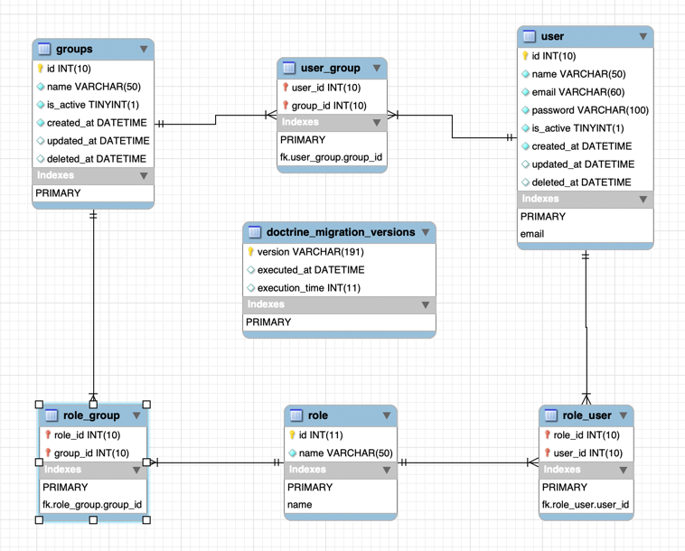

# Internations
## Internations admin bundle

The internations admin bundle in symfony 6.

- User management
- Groups management
- Roles management
- CRUD API
- ✨Magic ✨

## Live Demo:
Head to http://internations.3ageeb.com to check how this bundle works in action.
> Admin role:
> 
> Username: `admin@example.com`
> 
> Password: `123456`

> User role:
> 
> Username: `user@example.com`
> 
> Password: `123456`

## Features

- User roles/groups management system.
- Admins can mutate the users module and the other modules.
- Users can see the listings but has no mutations rights.

## UML Domain Diagram


## Database Entity Relationship Diagram
The `internations-ERD.mwb` is attached and can be imported.



## Tech

Used open source projects:

- [Symfony] - An awesome PHP Framework.
- [FOS/Rest Bundle] - A symfony bundle to handle the API calls.
- [Twig] - Great UI template engine
- [jQuery] - duh!


## Installation
Clone the repository to your local using `git clone` command.

Install the dependencies using the command:
```sh
cd internations
composer install
```

In your `.env` file, set the database credentials:
`DATABASE_URL="mysql://{DATABASE_USER}:{DATABASE_PASSWORD}@{DATABASE_HOST}:3306/{DATABASE_NAME}?serverVersion=8&charset=utf8mb4"`

Run the migrations:
```sh
php bin/console doctrine:migration:migrate
```

Load the example fixtures:
``` sh
php bin/console doctrine:fixtures:load
```

All good! Now you just need to start the symfony server with the command:
```sh
symfony server:start
```
You will be hosting the app propably on, that's where you can access it from the browser:
```sh
127.0.0.1:8000
```

---

## License

MIT

**Copy rights reserved to [Mahmoud Abdelsattar]!**

[symfony]: <https://symfony.com>
[git-repo-url]: <https://github.com/php-ini/internations.git>
[john gruber]: <http://daringfireball.net>
[df1]: <http://daringfireball.net/projects/markdown/>
[twig]: <https://twig.symfony.com>
[jQuery]: <http://jquery.com>
[Mahmoud Abdelsattar]: <mahmoudabdelsattar.com>
